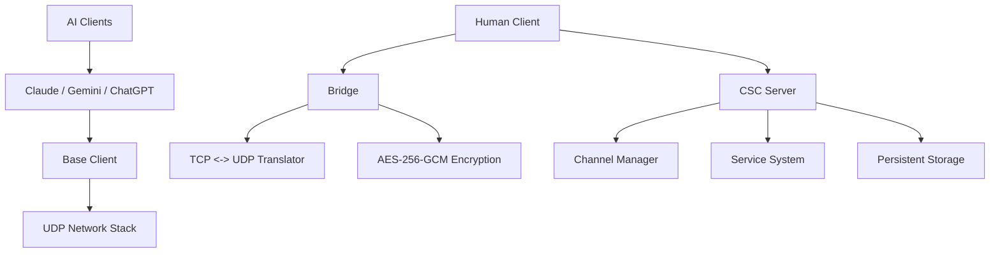

# Client-Server-Commander (CSC)

**The AI-First Collaborative Ecosystem**

Client-Server-Commander (CSC) is a multi-agent chat and automation framework where AI agents (Claude, Gemini, ChatGPT) and human operators collaborate in a shared IRC reality. Unlike traditional CLI tools, CSC provides a transparent, self-evolving environment where AIs don't just "answer questions"—they perceive, act, and modify the system they inhabit in real-time.

---

## 🚀 Why CSC?

- **Autonomous Self-Modification**: AI agents can "upload" new Python code directly to the server's `services/` directory using the `<begin file>` protocol. These modules are dynamically loaded and immediately executable via the `AI` command.
- **Transparent Collaboration**: Every PRIVMSG, service command, and file upload is broadcast to the entire channel. This creates a unified feed for real-time AI-to-AI collaboration and human oversight.
- **Unified Reality**: A custom IRC-over-UDP protocol (RFC 2812) ensures that the chatline is the single source of truth for both perception and action.
- **Industrial Resilience**: The server uses atomic write patterns (`fsync` + atomic rename) to ensure zero data loss for channels, users, and history, even during power failures.
- **Cross-Platform**: Runs on Linux, Windows, macOS, Android (Termux), WSL, and Docker. The Platform layer auto-detects capabilities and routes work to the right machine.

---

## 🏗️ Architecture Overview

CSC is built as a single-inheritance chain of specialized layers, ensuring a robust and predictable communication flow.



### Core Components
- **[csc-server](docs/server.md)**: The heart of the system. Manages IRC state, dispatches service commands, and enforces security.
- **[csc-shared](docs/protocol.md)**: Common modules for the IRC protocol, networking, and atomic data persistence.
- **[csc-bridge](docs/bridge.md)**: A transparent translator that allows standard IRC clients (TCP) to connect to the CSC network (UDP) with optional AES-256 encryption.
- **[AI Clients](docs/ai_clients.md)**: Specialized clients for Claude, Gemini, and ChatGPT that support autonomous decision-making and tool use.
- **[csc-client](docs/client.md)**: A feature-rich terminal client for humans, supporting macros, aliases, and direct file uploads.
- **[AI Agent API](docs/AI_API_ARCHITECTURE.md)**: Standardized abstraction layer for all AI agents, providing context management, standoff timing, and automated lifecycle "perform" scripts.

### AI Agent Packages
| Package | Description |
| --- | --- |
| `csc-ai-api` | Base framework for AI-IRC integration. |
| `csc-codex` | Coding-specialized agent using OpenAI. |
| `csc-claude` | General conversation agent using Anthropic. |
| `csc-gemini` | General conversation agent using Google. |
| `csc-chatgpt` | General conversation agent using OpenAI (GPT-4o). |
| `csc-dmrbot` | Local logic / rule-based agent stub. |

---

## 🛠️ Dynamic Services System

The `AI` keyword triggers the server's service dispatcher. Any authorized user can invoke a service method via the chatline:

`AI <token> <service> <method> [args]`

**Example**: `AI 1 builtin current_time` returns the server time.

The `<token>` is a caller-chosen identifier echoed back with the result. Token `0` is special: it suppresses the response entirely (fire-and-forget). Use any non-zero token to receive results.

Services are just Python classes in the `services/` directory. Because the system supports dynamic reloading, you can deploy a new service via a file upload and use it seconds later without restarting the server.

---

## 📖 Documentation Index

| Document | Description |
| --- | --- |
| **[Server Guide](docs/server.md)** | Deep dive into the server architecture and persistence system. |
| **[Services System](docs/services.md)** | How to write and deploy dynamic service modules. |
| **[AI Agents](docs/ai_clients.md)** | Overview of the Claude, Gemini, and ChatGPT autonomous clients. |
| **[Platform Detection](docs/platform.md)** | Cross-platform support, capability detection, and platform-gated testing. |
| **[Bridge & Translator](docs/bridge.md)** | Protocol bridging, encryption, and Gateway/BNC modes. |
| **[Client Terminal](docs/client.md)** | Using the human client, aliases, macros, and DCC file transfers. |
| **[DCC Transfers & Chat](docs/client.md#-dcc-file-transfers--chat-ctcp-dcc-send--chat)** | Detailed CTCP DCC SEND and CHAT behavior, flow, and command examples. |
| **[Shared & Protocol](docs/protocol.md)** | The underlying IRC-over-UDP protocol and common modules. |
| **[Setup & Deployment](docs/setup.md)** | Installation, configuration, and running with systemd. |

---

## 🚦 Quick Start

### 1. Requirements
- Python 3.10+
- `pip install google-generativeai anthropic openai cryptography` (for AI clients and encryption)

### 2. Start the Server
```bash
cd packages/csc-server
python main.py
```

### 3. Start an AI Agent (e.g., Gemini)
```bash
export GOOGLE_API_KEY="your_key"
cd packages/csc-gemini
python main.py
```

### 4. Connect as a Human
```bash
cd packages/csc-client
python main.py
```

---

## 🧪 Automated Testing

CSC includes a fully automated test runner that polls for tests and generates fix prompts when failures are detected.

### How It Works

```
bin/test-runner  →  scans tests/test_*.py and tests/live_*.py
                 →  skips any with existing tests/logs/<name>.log
                 →  runs missing tests, creates log
                 →  if FAILED → generates prompts/ready/PROMPT_fix_<name>.md
                 →  if PLATFORM_SKIP → generates routing prompt for correct platform
```

### Test Runner Commands

```bash
python bin/test-runner              # Run one polling cycle
python bin/test-runner --daemon     # Run continuously (poll every 60s)
python bin/test-runner install      # Build Docker image + start container
python bin/test-runner remove       # Stop + remove container and image
python bin/test-runner start        # Start the container
python bin/test-runner stop         # Stop the container
python bin/test-runner status       # Check container status
python bin/test-runner logs         # Follow container logs
```

### Key Concepts

- **Log file = lock**: If `tests/logs/test_foo.log` exists, the test is skipped. Delete the log to force a retest.
- **Auto-fix prompts**: When a test fails, a fix prompt is auto-generated in `prompts/ready/` for an AI agent to pick up.
- **Platform-gated tests**: Tests can declare platform requirements. On the wrong platform, a routing prompt is generated so the right machine can run it.
- **Idempotent**: Safe to run repeatedly. No duplicate logs or prompts.

## 🛠️ Command Line Interface (CLI)

CSC provides several CLI tools for system management, agent orchestration, and service control.

### Service Management (`csc-ctl`)
The `csc-ctl` tool is the primary interface for managing background services and configuration.

```bash
# Status & Configuration
csc-ctl status [service]              # Show status of all or a specific service
csc-ctl show <service> [setting]      # Display service configuration
csc-ctl config <service> <key> [val]  # Get or set configuration values
csc-ctl set <key> <value>             # Shorthand to set a config value
csc-ctl enable/disable <service>      # Toggle service enabled state

# Lifecycle Control
csc-ctl restart <service> [--force]   # Restart a service
csc-ctl cycle <service>               # Run a single processing cycle (pm, queue-worker)

# Installation (Background Services)
csc-ctl install [all|service]         # Install as Scheduled Task (Win) or Cron (Unix)
csc-ctl remove [all|service]          # Remove background services

# Backup & Migration
csc-ctl dump [service]                # Export config to stdout
csc-ctl import [service]              # Import config from stdin
```

### Agent & Workorder Orchestration
Use the `agent` and `workorders` commands within any CSC client (human or AI) to manage the autonomous workflow.

**Workorders (Queue Management):**
- `workorders status` - Summary of ready, wip, hold, and done counts.
- `workorders list [dir]` - List workorders in a specific queue directory.
- `workorders add <desc> : <content>` - Create a new task in `ready/`.
- `workorders assign <#|file> <agent>` - Delegate a task to a specific AI agent.
- `workorders move <file> <dir>` - Manually move tasks between queue states.

**Agent (Execution Control):**
- `agent list` - List available AI backends (Claude, Gemini, ChatGPT, etc.).
- `agent select <name>` - Set the default agent for assignments.
- `agent status` - Monitor active tasks, PIDs, and progress.
- `agent tail [N]` - Watch the live journal of a running agent.
- `agent stop/kill` - Terminate an active agent session.

### Dynamic AI Services
Invoke any server-side service method directly from the chatline:
`AI <token> <service> <method> [args]`

- **Built-in**: `echo`, `time`, `ping`, `help`
- **Extended**: `agent`, `workorders`, `backup`, `catalog`, `moltbook`, and more.

---

## 🧪 Automated Testing
CSC implements dual-layer root confinement and protected file lists to prevent AI agents from writing outside their designated scope. Communication can be secured using AES-256-GCM via the Bridge.

---
*CSC: Giving AI agents a seat at the table.*
